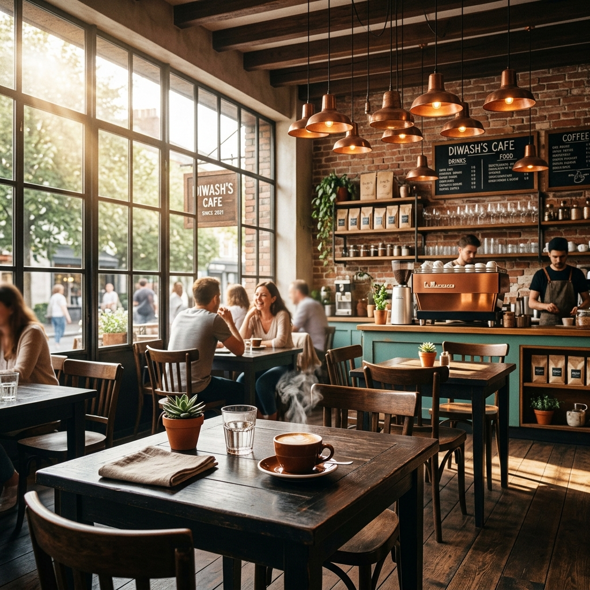
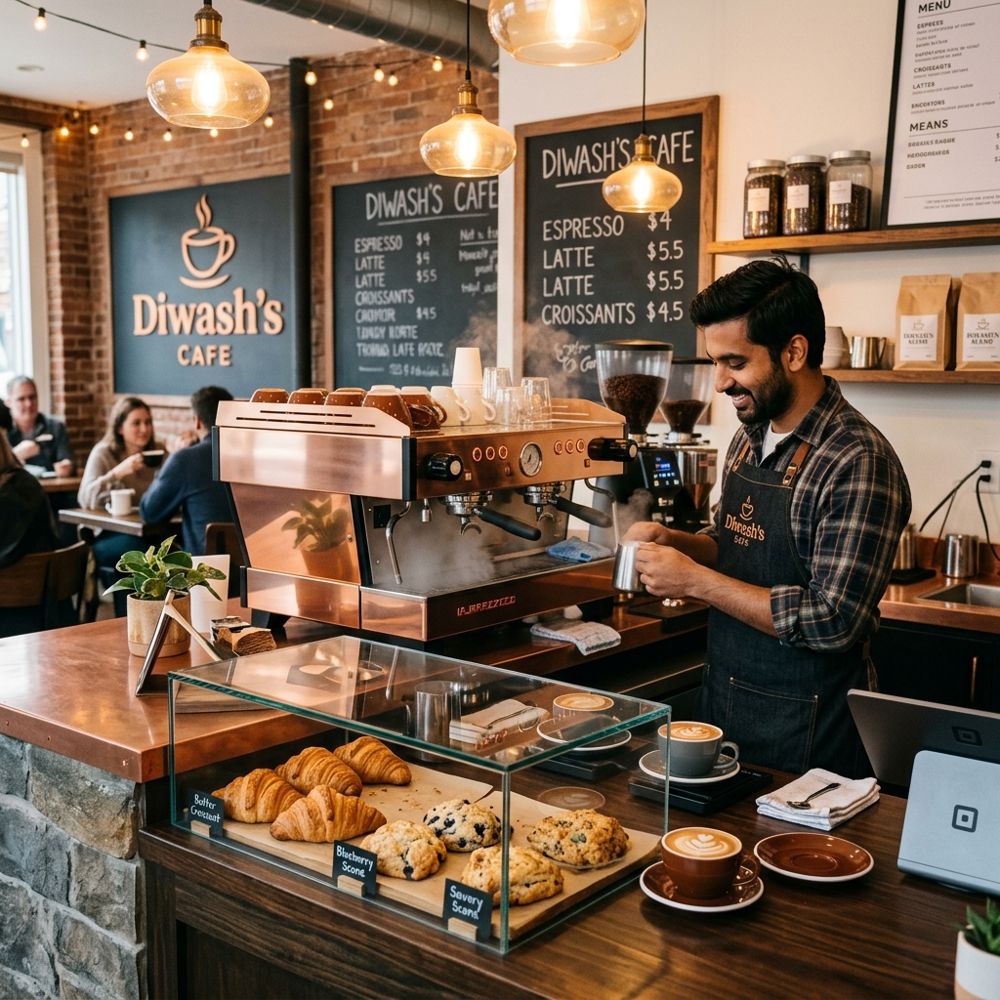
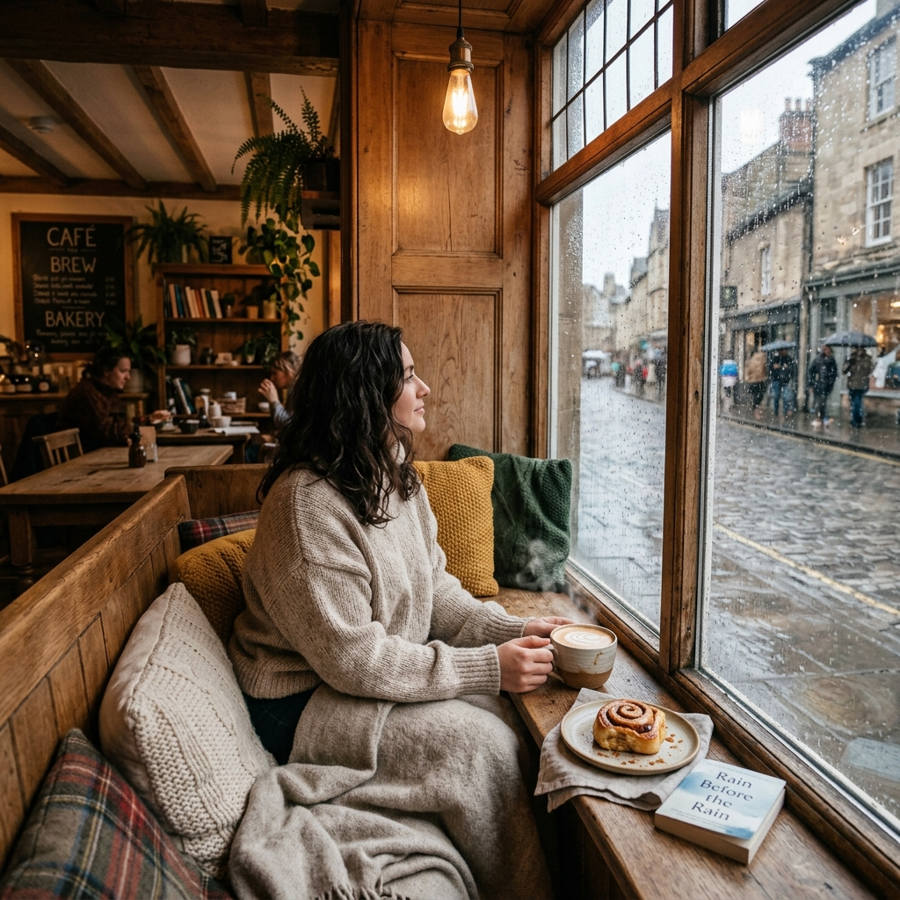
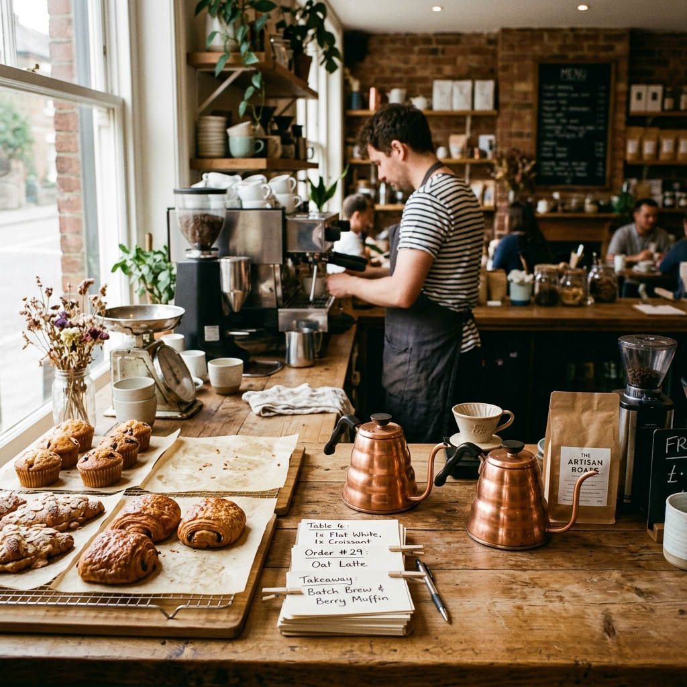
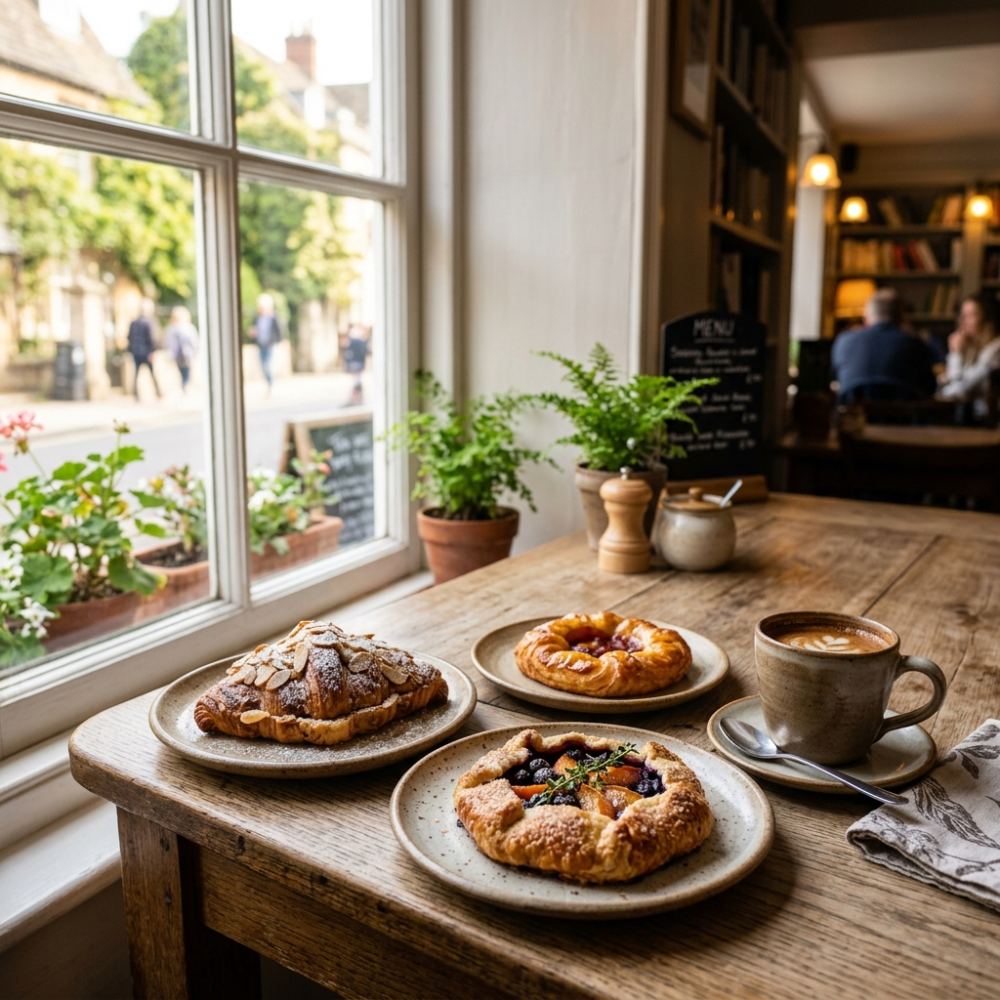

# ☕ Diwash's Café — Neighborhood Coffee Room

A modern, editorial web application for **Diwash's Café**, located at Bhagwati Tole-3. Built with React, Vite, Tailwind CSS, TypeScript, and Express.

---

## 📷 Gallery & Photography Showcase

Below are the high-resolution photography assets stored in `client/public/images/` and showcased in the live application:

### 🌟 Hero Banner & Ambience


### 🪑 Café Counter & Cozy Seating
| Café Counter | Cozy Window Table |
| :---: | :---: |
|  |  |

### ☕ Artisanal Drinks & Kitchen
| Signature Espresso | Kitchen & Checkout Header |
| :---: | :---: |
|  |  |

### 🥐 Bakery, Pastry & Warm Service
| Fresh Bakery & Pastry | Warm Hospitality |
| :---: | :---: |
|  |  |

---

## 🌟 Key Features
- ☕ **Interactive Menu**: Explore artisanal drinks, bakery treats, and kitchen specialties with custom dietary preferences.
- 🛒 **Order Ahead**: Seamless pre-order workflow with real-time selection summary.
- 📅 **Table Reservations**: Book a table online with instant confirmation.
- 📍 **Location & Directions**: Interactive map centered at Bhagwati Tole-3 (27.868446, 83.545261).
- 🎨 **Hearth & Paper Design System**: Warm editorial typography (DM Serif Display + Inter), copper accent lines, and tactile paper surface textures.

---

## 🛠️ Tech Stack
- **Frontend**: React, Vite, Wouter (Routing), Tailwind CSS, Lucide Icons
- **Backend**: Node.js, Express, TypeScript
- **Deployment**: GitHub Pages (Automated via GitHub Actions)

---

## 🚀 Getting Started

### 1. Install Dependencies
```bash
npm install
```

### 2. Run Development Server
```bash
npm run dev
```

### 3. Build for Production
```bash
npm run build
```

---

© 2026 Diwash's Café · Bhagwati Tole-3
